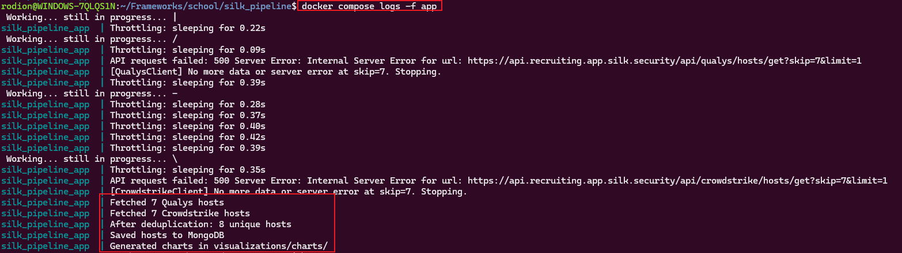
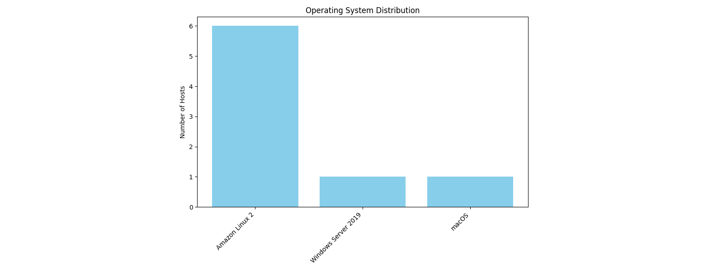
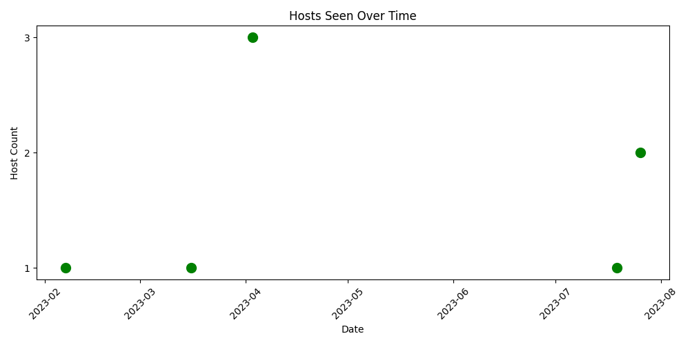

# Silk Host Data Pipeline

This project fetches host data from Qualys and Crowdstrike APIs, normalizes the data into a unified format, deduplicates entries using smart heuristics (hostname, IPs, MACs), stores them in MongoDB, and generates charts for analysis located in `./visualizations/charts`.

## How to Run

1. Clone the repo and copy `.env.example` to `.env`
2. Run the pipeline:

```bash
docker compose up -d --build
docker compose logs -f app
```



## Visualizations `(./visualizations/charts)`




